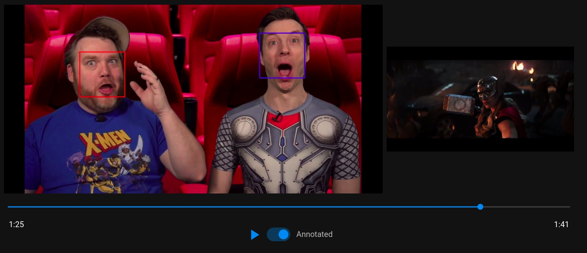
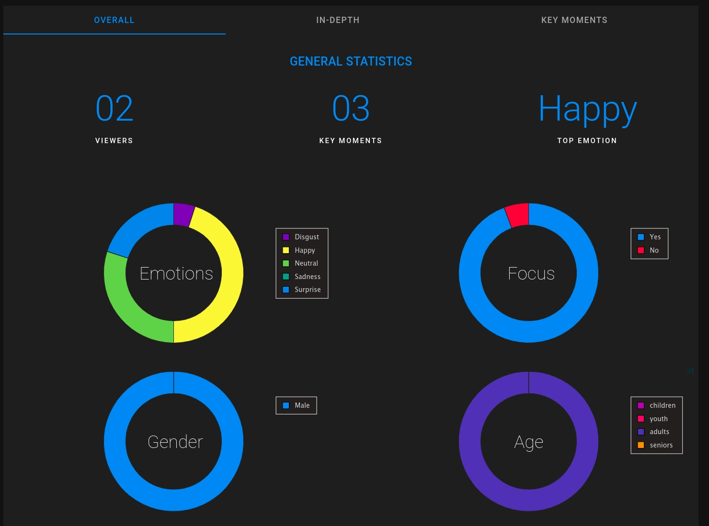
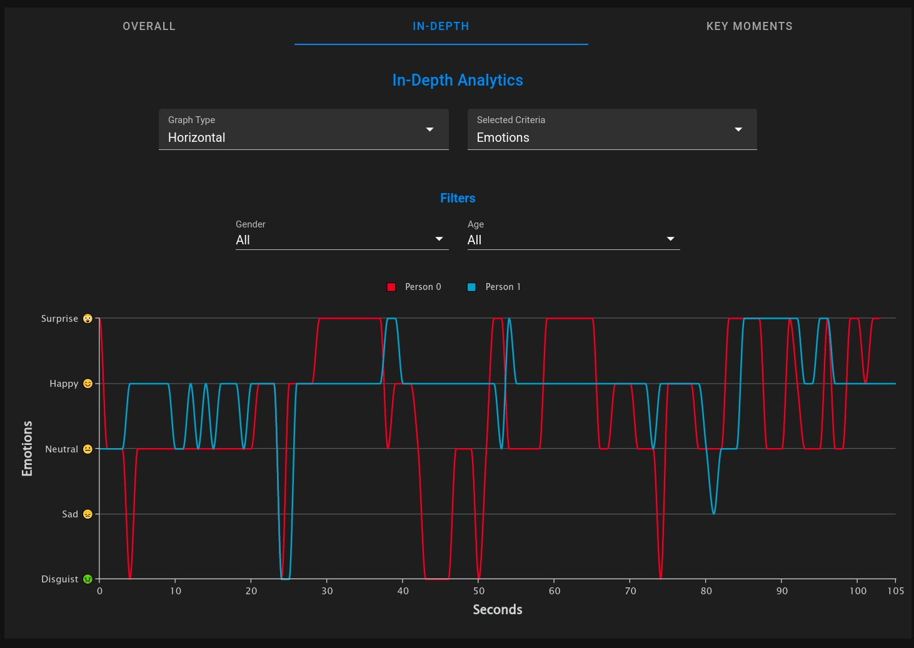

# Feelback: An Automated Video Feedback Application

<p align="center">
 
</p>

<p align="center"><strong> An Automated Video Feedback Application </strong></p>

</br>

Feelback is deployed at https://feelbackdemo.me

---

# Video Demo
https://user-images.githubusercontent.com/42312059/181577200-d568c8a2-3c77-4fbc-b023-ca77b8c2054f.mp4


# Screenshots


</br>



</br>



</br>


</br>


# System Architecture


</br>

---

# Install Dependencies
- Install [python](https://www.python.org/) >= 3.6
- Install [conda](https://docs.conda.io/projects/conda/en/latest/user-guide/install/index.html) 
- `conda env create -f requirements.yml`


# How to use
## CLI
CLI is used only to create annotated video, visualizations, and testing

It DOES NOT generate analytics

### **Usage**
**Sample Usage**
```
python feelback_cli.py input_video -o output -f native -v
```

**All Options**
```
Feelback is An Automated Video Feedback Framework

positional arguments:
  input_video           Input Video File Path

options:
  -h, --help            show this help message and exit
  -o filename, --output filename
                        Save processed video to filename.mp4
  --output-annotations annotations [annotations ...]
                        Which annotations to add to processed video
                        annotations can be any of: ['all', 'none', 'ids', 'age', 'gender', 'emotions', 'attention']
                        You can add multiple annotations separated by space
                        Default: all
                        
  --dump filename       Dump Feelback Object After Processing
  --load filename       Load Dumped Feelback Object [For Debug]
  --output-key-moments filename
                        Save Key Moments Visualizations to file
  -f N | native, --fps N | native
                        Process N frames every second, Or `native` to process all frames
  -v, --verbose         Enable more verbosity              
```

## Backend
- Create a `.env` file like the `example.env` file and change the following variables: `UPLOAD_FOLDER`, `ANNOTATED_UPLOAD_FOLDER`, `DATABASE_URL`, `THUMBNAILS_FOLDER`
- run `python feelback_server.py` to run development server

## Frontend
- Install [node.js](https://nodejs.org) >= 16
- cd into `feelback-front`
- run `npm install`
- run `npm run serve`
- to build for production, run `npm run build` 
